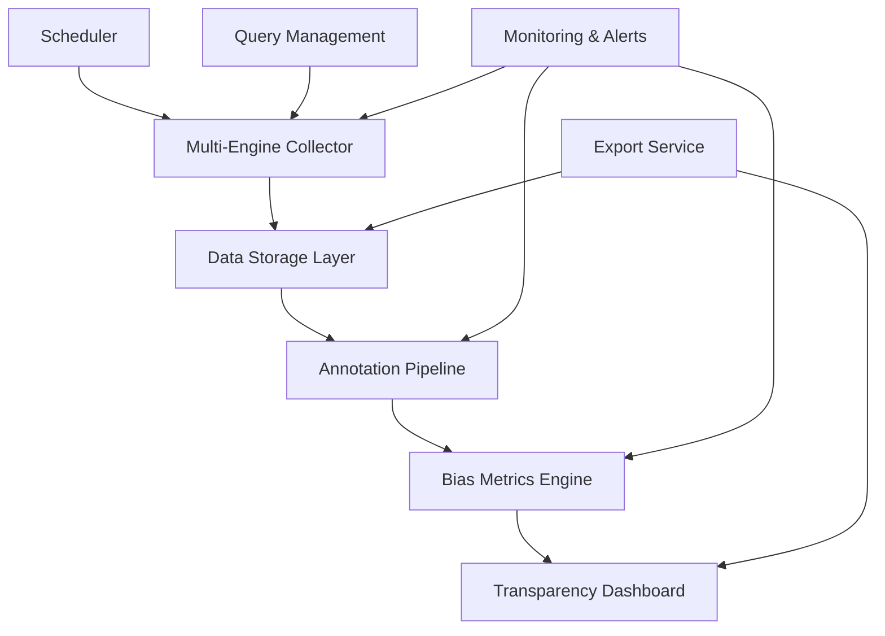
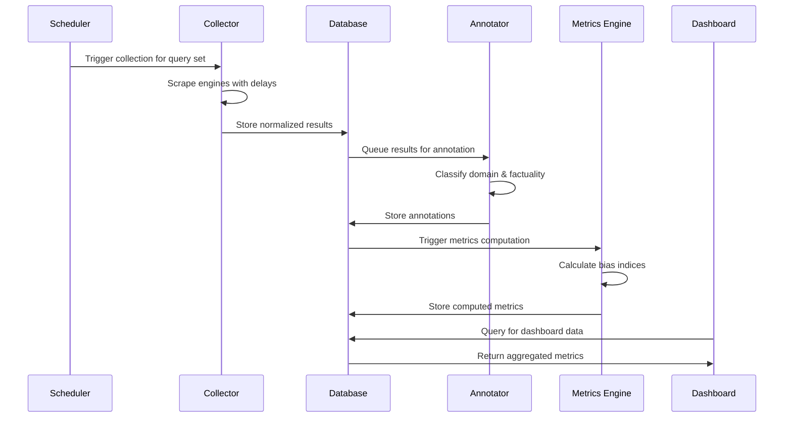

# TruthLayer MVP Design Document

## Overview

TruthLayer is designed as a modular, scalable system for collecting, processing, and analyzing search engine results to measure algorithmic bias. The architecture follows a pipeline pattern with distinct layers for data collection, annotation, metrics computation, and visualization. The system prioritizes data integrity, reproducibility, and cost-effective processing while handling the challenges of web scraping at scale.

## Architecture

The system consists of five core components organized in a data pipeline architecture:



### Component Responsibilities

- **Scheduler**: Orchestrates automated data collection cycles
- **Multi-Engine Collector**: Scrapes and normalizes search results
- **Data Storage Layer**: Manages raw data, processed results, and metadata
- **Annotation Pipeline**: Classifies results using LLM analysis
- **Bias Metrics Engine**: Computes transparency metrics and trends
- **Transparency Dashboard**: Provides web interface for visualization and export

## Components and Interfaces

### Multi-Engine Collector

**Purpose**: Collect and normalize search results from multiple engines while avoiding detection.

**Key Features**:
- Engine-specific scrapers for Google, Bing, Perplexity, and Brave
- Proxy rotation and request throttling
- Result normalization to common schema
- Raw HTML preservation for auditing

**Interface**:
```typescript
interface SearchResult {
  id: string;
  query: string;
  engine: 'google' | 'bing' | 'perplexity' | 'brave';
  rank: number;
  title: string;
  snippet: string;
  url: string;
  timestamp: Date;
  rawHtml?: string;
}

interface CollectorService {
  collectResults(query: string, engines: string[]): Promise<SearchResult[]>;
  validateResults(results: SearchResult[]): boolean;
  normalizeResult(rawResult: any, engine: string): SearchResult;
}
```

**Technical Implementation**:
- Node.js with Puppeteer for browser automation
- Rotating proxy pool with health checking
- Random delays (2-8 seconds) between requests
- User-agent rotation and realistic browser fingerprinting
- Retry logic with exponential backoff

### Data Storage Layer

**Purpose**: Efficiently store and retrieve search results, annotations, and computed metrics.

**Schema Design**:
```sql
-- Core search results table
CREATE TABLE search_results (
  id UUID PRIMARY KEY,
  query_id UUID REFERENCES queries(id),
  engine VARCHAR(20) NOT NULL,
  rank INTEGER NOT NULL,
  title TEXT NOT NULL,
  snippet TEXT,
  url TEXT NOT NULL,
  collected_at TIMESTAMP NOT NULL,
  content_hash VARCHAR(64),
  raw_html_path TEXT
);

-- Query metadata
CREATE TABLE queries (
  id UUID PRIMARY KEY,
  text TEXT NOT NULL,
  category VARCHAR(50),
  created_at TIMESTAMP NOT NULL
);

-- Annotation results
CREATE TABLE annotations (
  id UUID PRIMARY KEY,
  result_id UUID REFERENCES search_results(id),
  domain_type VARCHAR(20),
  factual_score DECIMAL(3,2),
  confidence_score DECIMAL(3,2),
  model_version VARCHAR(50),
  annotated_at TIMESTAMP NOT NULL
);
```

**Storage Strategy**:
- PostgreSQL for transactional data and complex queries
- Parquet files for analytical datasets and exports
- S3/MinIO for raw HTML storage and backups
- Partitioning by date and engine for query performance

### Annotation Pipeline

**Purpose**: Classify search results using LLM analysis for domain type and factual consistency.

**Classification Schema**:
- **Domain Types**: news, government, academic, blog, commercial, social
- **Factual Scores**: 0.0-1.0 scale for factual reliability
- **Confidence Scores**: 0.0-1.0 scale for annotation certainty

**LLM Integration**:
```typescript
interface AnnotationRequest {
  title: string;
  snippet: string;
  url: string;
  query: string;
}

interface AnnotationResponse {
  domainType: string;
  factualScore: number;
  confidenceScore: number;
  reasoning: string;
}

interface AnnotationService {
  annotateResult(request: AnnotationRequest): Promise<AnnotationResponse>;
  batchAnnotate(requests: AnnotationRequest[]): Promise<AnnotationResponse[]>;
}
```

**Prompt Engineering**:
- Versioned prompts stored in configuration
- Few-shot examples for consistent classification
- Chain-of-thought reasoning for transparency
- Model temperature set to 0.1 for consistency

### Bias Metrics Engine

**Purpose**: Compute quantitative bias metrics and track changes over time.

**Core Metrics**:

1. **Domain Diversity Index**:
   ```
   DDI = unique_domains / total_results
   Range: 0.0-1.0 (higher = more diverse)
   ```

2. **Engine Overlap Coefficient**:
   ```
   EOC = shared_urls / total_unique_urls
   Range: 0.0-1.0 (higher = more overlap)
   ```

3. **Factual Alignment Score**:
   ```
   FAS = weighted_average(factual_scores)
   Range: 0.0-1.0 (higher = more factual)
   ```

**Trend Analysis**:
- Rolling 7-day and 30-day averages
- Statistical significance testing for changes
- Anomaly detection for sudden shifts
- Cross-engine comparative analysis

### Transparency Dashboard

**Purpose**: Provide interactive visualization and data export capabilities.

**Key Views**:
- **Overview Dashboard**: High-level metrics across all engines
- **Engine Comparison**: Side-by-side bias metric comparisons
- **Trend Analysis**: Time-series visualizations of metric changes
- **Query Explorer**: Drill-down analysis for specific queries
- **Data Export**: CSV/JSON export with filtering options

**Technical Stack**:
- Next.js for server-side rendering and API routes
- Chart.js for interactive visualizations
- Tailwind CSS for responsive design
- React Query for data fetching and caching

## Data Models

### Core Data Flow



### Query Management

**Benchmark Query Sets**:
- **Health**: "covid vaccine safety", "mental health treatment", "cancer screening guidelines"
- **Politics**: "election results 2024", "climate change policy", "immigration reform"
- **Technology**: "AI safety research", "cryptocurrency regulation", "data privacy laws"
- **Science**: "renewable energy efficiency", "space exploration news", "genetic engineering ethics"

**Query Rotation Strategy**:
- 50 core queries executed daily
- 200 extended queries executed weekly
- Seasonal/event-driven queries added dynamically
- A/B testing for query effectiveness

## Error Handling

### Scraping Failures

**Common Issues**:
- CAPTCHA challenges
- Rate limiting and IP blocking
- Network timeouts and connection errors
- Page structure changes

**Mitigation Strategies**:
- Automatic proxy rotation on detection
- Exponential backoff with jitter
- Fallback to alternative scraping methods
- Manual review queue for persistent failures

### Annotation Errors

**LLM-Related Issues**:
- API rate limits and quota exhaustion
- Model hallucination and inconsistent outputs
- Context length limitations
- Service availability issues

**Quality Assurance**:
- Confidence score thresholds for auto-acceptance
- Human review for low-confidence annotations
- Cross-validation with multiple models
- Regular accuracy audits on sample data

### Data Integrity

**Validation Checks**:
- Content hash verification for duplicate detection
- Schema validation for all stored data
- Completeness checks for collection cycles
- Anomaly detection for unusual patterns

**Recovery Procedures**:
- Automatic retry for transient failures
- Data backfill for missed collection windows
- Rollback capabilities for corrupted data
- Alert escalation for critical failures

## Testing Strategy

### Unit Testing

**Coverage Areas**:
- Result normalization logic
- Bias metric calculations
- Data validation functions
- API endpoint responses

**Testing Framework**:
- Jest for JavaScript/TypeScript components
- pytest for Python annotation pipeline
- Mock external services (search engines, LLM APIs)
- Property-based testing for metric calculations

### Integration Testing

**End-to-End Scenarios**:
- Complete data collection and processing pipeline
- Dashboard data loading and visualization
- Export functionality with various filters
- Error handling and recovery workflows

**Test Environment**:
- Containerized test environment with Docker
- Sample datasets for consistent testing
- Mocked external dependencies
- Automated testing in CI/CD pipeline

### Performance Testing

**Load Testing**:
- Concurrent scraping performance
- Database query optimization
- Dashboard response times under load
- Memory usage during batch processing

**Scalability Testing**:
- Large dataset processing capabilities
- Multi-engine concurrent collection
- Dashboard performance with historical data
- Export generation for large datasets

## Security and Privacy

### Data Protection

**Sensitive Data Handling**:
- No collection of personal information from search results
- Anonymization of IP addresses in logs
- Secure storage of API keys and credentials
- Regular security audits and updates

### Compliance Considerations

**Web Scraping Ethics**:
- Respect for robots.txt files
- Reasonable request rates to avoid service disruption
- Transparent data collection practices
- Compliance with terms of service where possible

**Data Retention**:
- 2-year retention policy for raw search results
- Indefinite retention for aggregated metrics
- Secure deletion procedures for expired data
- User data access and deletion rights

This design provides a robust foundation for the TruthLayer MVP while maintaining flexibility for future enhancements and scaling requirements.